# Newspaper Explorer

> **Initially created at [culture.explore(data)](https://lab.sbb.berlin/culture-explore-data/) Hackathon**  
> *7-8 October 2025, Staatsbibliothek zu Berlin*

A toolkit for exploring historical newspapers through computational analysis. Historical newspaper archives contain thousands of pages locked in ALTO XML format. Exploring this data requires downloading, parsing, cleaning, and analyzing, yet standardized tools connecting raw data to statistical, NLP, computer vision, and LLM workflows remain scarce. 

Built during a two-day hackathon, this project provides an initial starting point for researchers, students, and cultural heritage professionals to explore large newspaper datasets under a unified interface combining traditional data analysis with modern AI approaches. It showcases how diverse computational methods (statistical analysis, named entity recognition, topic modeling, layout detection, and LLM-powered insights) can work together on cultural heritage data and allows researchers a first step into unknown datasets, generating visualizations and insights that surface patterns and possibilities before specific research questions have been formulated. 

During the hackathon, we experimented with various data analysis approaches, testing GLiNER for named entity extraction, a tool for knowledge graph generation, various models for layout detection, LLM-based topic modeling, and a custom emotion classification BERT-model from Universität Würzburg. However, this exploration quickly revealed the central challenge: the "Der Tag" dataset for the years 1900-1920 contains **~148,000 XML files** with **61+ million text lines** from **135,000 page images**, totaling over **10 GB of compressed XML files** and **200 GB of JPEG images**. Working with a dataset of this scale proved a significant challenge during the two days of the hackathon, so some analyses were performed on data subsets due to computational and time constraints. Future development will focus on optimizing the codebase to efficiently process the complete dataset.

Built with open cultural data from the Stiftung Preußischer Kulturbesitz.


[](https://www.python.org/downloads/)
[](https://opensource.org/licenses/MIT)

## Key Features

- **Configuration-Driven Pipeline**: Download → extract → parse → analyze workflow controlled by source JSON files
- **High Performance**: Parallel ALTO/METS parsing with Polars DataFrames and DuckDB SQL queries on multi-GB datasets
- **LLM Integration**: Structured prompts with Pydantic schemas for entity extraction, topic analysis, emotion detection
- **Complete Traceability**: Unified ID system tracks lineage from source → issue → page → text block → line
- **Historical Text Support**: Preprocessing pipeline with normalization, cleaning, and lemmatization for German historical text
- **Image Downloads**: Retrieve high-resolution newspaper page scans from METS references
- **Smart Resume**: Automatic tracking of processed files to avoid reprocessing
- **Modular CLI**: Clean command structure with comprehensive validation and status tracking

---

## Web Interface

A modern web interface provides intuitive access to analysis results and exploration tools. Launch with `newspaper-explorer ui start`. The interface is currently work in progress.

<details>
<summary>📸 View screenshots from the web interface</summary>

### Overview Dashboard
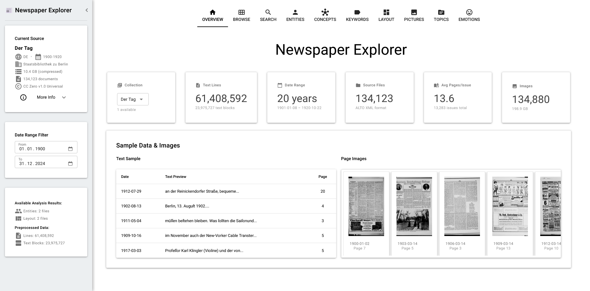
*Screenshot: Main dashboard providing an overview of available datasets and analysis results*

### Browse and Explore
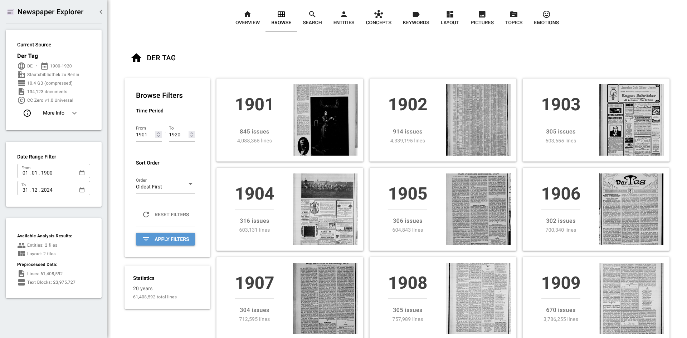
*Screenshot: Browse and explore newspaper pages with filtering and search capabilities*

</details>

---

## Hackathon Demo: Streamlit UI

During the two-day hackathon, we built a Streamlit-based web interface to showcase the first results of our various analysis approaches on the "Der Tag" dataset. These screenshots demonstrate the exploratory analysis capabilities we tested.

<details>
<summary>📸 View screenshots from the Streamlit demo (October 2025)</summary>

### Entity Extraction Dashboard
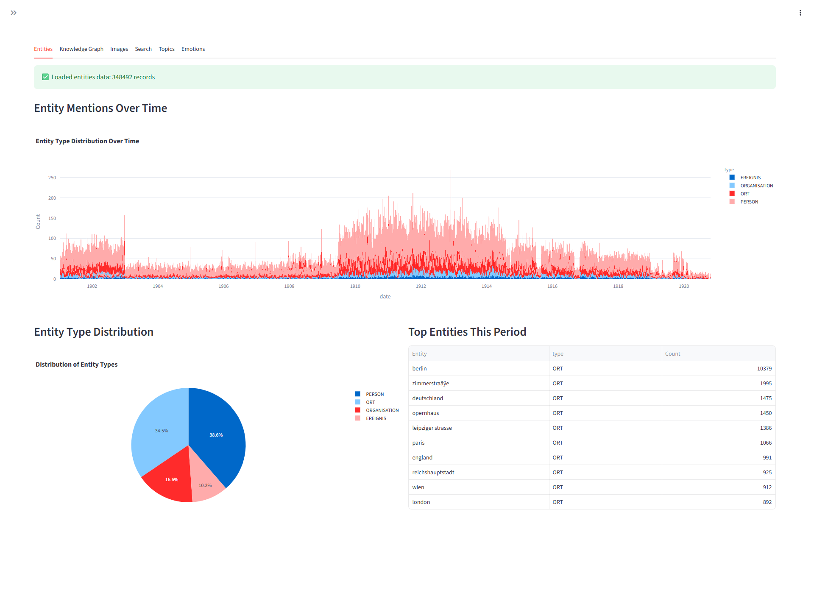
*Screenshot: Named entity recognition extracting persons, organizations, locations, events with GLiNER*

### Concept Extraction
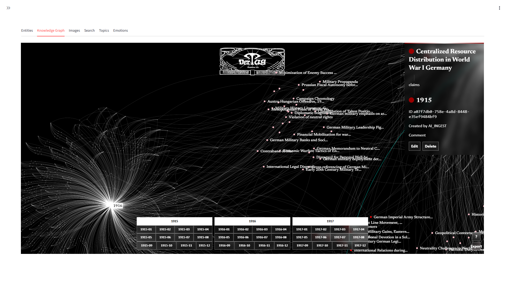
*Screenshot: Knowledge Graph created with automated concept extraction from newspaper text using Google Gemini*

### Layout Analysis
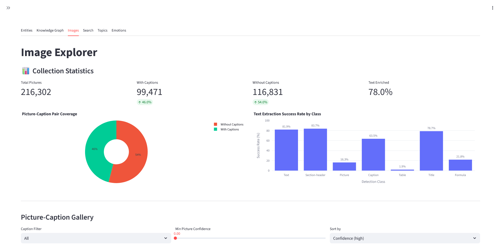
*Screenshot: YOLOv11-based layout detection identifying headlines, text blocks, and images*

### Layout Pictures Gallery
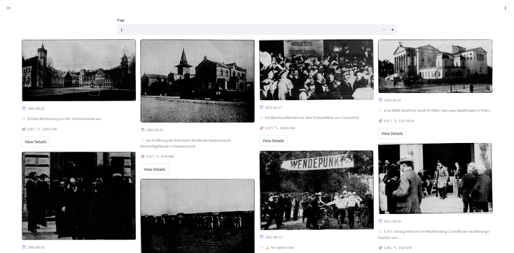
*Screenshot: Gallery view of detected image regions from newspaper pages*

### Layout Pictures with Captions
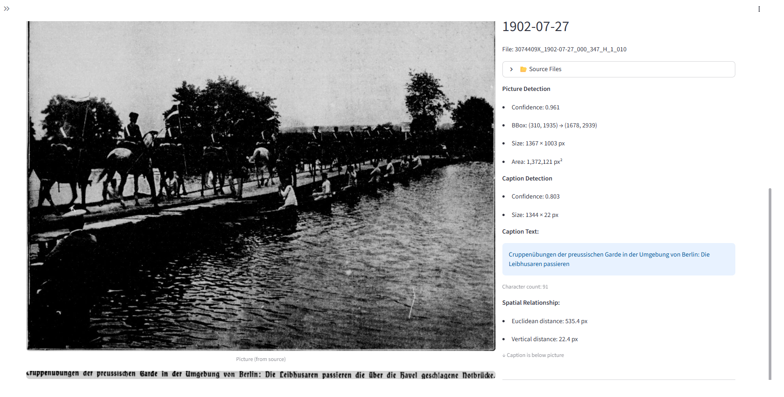
*Screenshot: Detailed view of extracted images with their captions*

### Search and Word Cloud
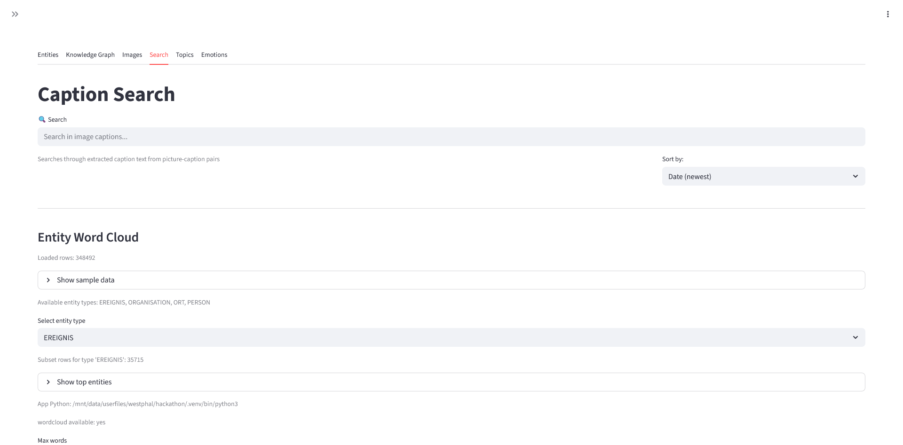
*Screenshot: Caption search interface with word cloud settings*

### Entities Word Cloud
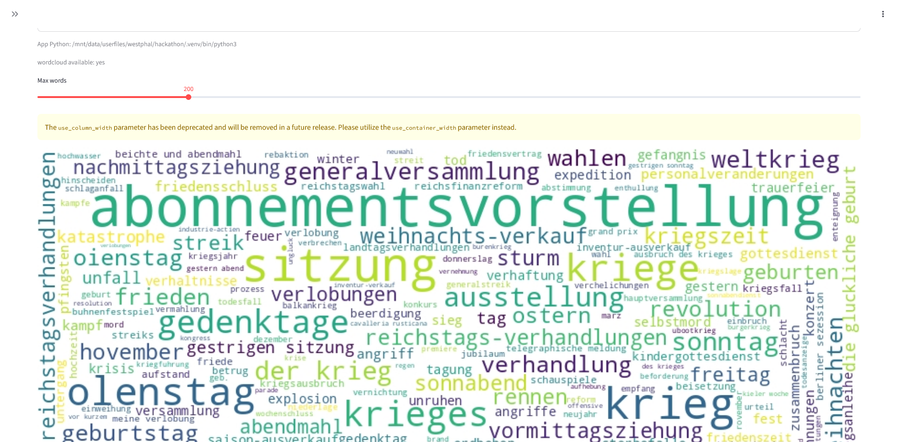
*Screenshot: Word cloud visualization of extracted named entities*

### Topic Modeling
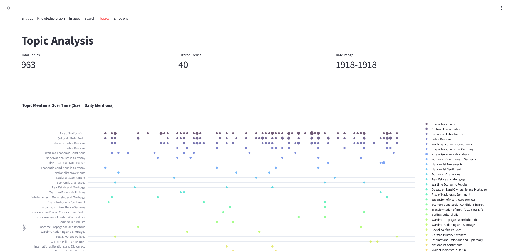
*Screenshot: Topic modeling analysis showing thematic clusters, topics where extracted using LLMs via OpenRouter*

### Topic Modeling
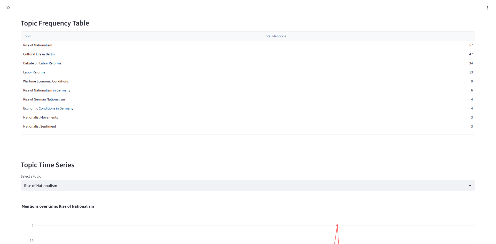
*Screenshot: Topic evolution over time across newspaper issues*

### Topic Modeling
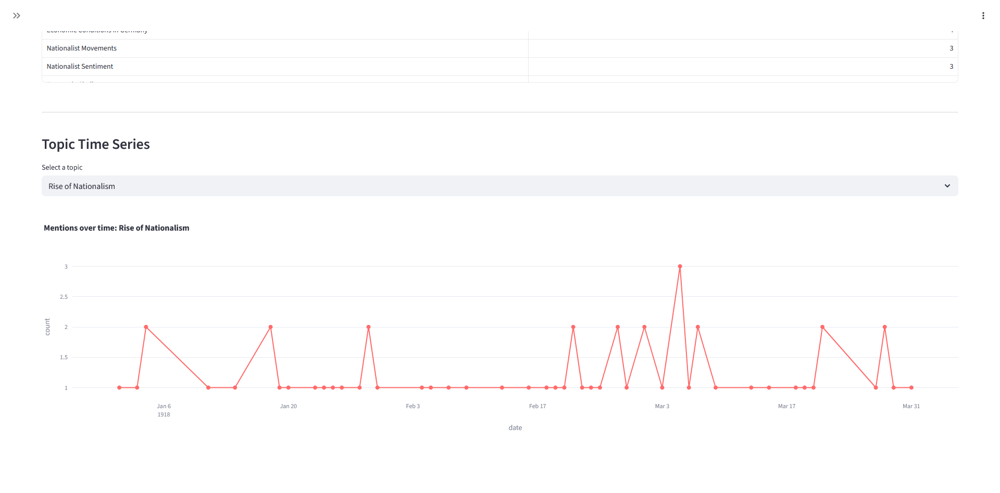
*Screenshot: Detailed view of individual topics with representative texts*

### Emotion Analysis
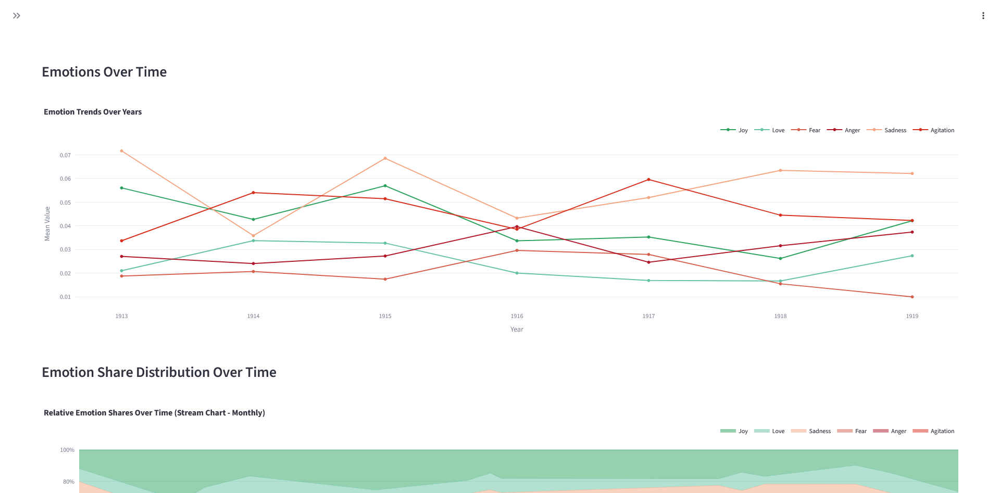
*Screenshot: Distribution of emotional content in the corpus, a classification model developed at Universität Würzburg was used (https://github.com/LeKonArD/Gattungen_und_Emotionen_dhd2023/tree/main)*

### Emotion Analysis
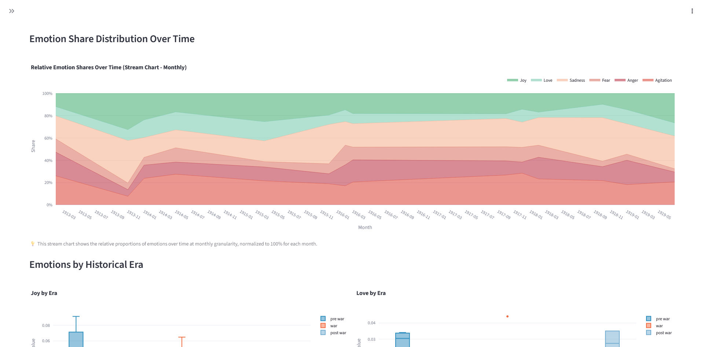
*Screenshot: Emotional patterns over time*

### Emotion Analysis
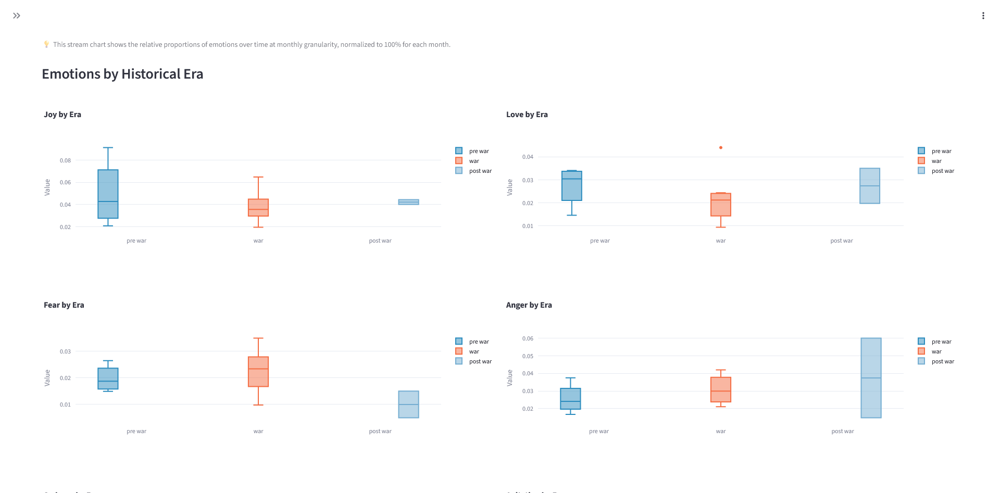
*Screenshot: Detailed emotion analysis with text examples*

</details>

---

## Table of Contents

- [Installation](#installation)
- [Quick Start](#quick-start)
- [Analysis Methods](#analysis-methods)
- [Core Concepts](#core-concepts)
- [Python API](#python-api)
- [Documentation](#documentation)
- [Available Datasets](#available-datasets)
- [Development](#development)
- [License](#license)

## Installation

```bash
# Install uv if needed
pip install uv

# Clone and setup
git clone https://github.com/newspaper-collective/newspaper_explorer.git
cd newspaper_explorer

# Copy environment template and configure
cp .env.example .env
# Edit .env to add your LLM API credentials if using LLM features

# Create venv and install
uv venv
source .venv/bin/activate  # Linux/Mac
# or: .venv\Scripts\Activate.ps1  # Windows PowerShell

# Install with all dependencies
uv pip install -e .

# Optional: Install development tools
uv pip install -e ".[dev]"
```

See **[Installation Guide](docs/INSTALL.md)** for detailed instructions and troubleshooting.

---

## Quick Start

**Complete workflow from download to analysis:**

```bash
# 1. List available sources
newspaper-explorer data list-sources

# 2. Download newspaper data
newspaper-explorer data download --part dertag_1900-1902

# 3. Unpack archives
newspaper-explorer data unpack --source der_tag

# 4. Parse ALTO XML to Parquet with METS metadata
newspaper-explorer data parse --source der_tag

# 5. Aggregate lines into text blocks
newspaper-explorer data aggregate --source der_tag

# 6. Check comprehensive status
newspaper-explorer data info --source der_tag

# 7. Optional: Download page images
newspaper-explorer data download-images --source der_tag --max-workers 8

# 8. Optional: Preprocess text (normalize, clean, lemmatize)
newspaper-explorer data preprocess --source der_tag --normalize --lemmatize
```

**Then analyze with Python** - see **[Python API Examples](docs/PYTHON_API.md)** for:
- Loading and querying data with Polars/DuckDB
- LLM analysis with structured outputs
- Entity extraction
- Text preprocessing

**Or explore via CLI** - see **[CLI Reference](docs/cli/CLI.md)** for all commands.

---

## Analysis Methods

The toolkit provides multiple analysis approaches that can be combined for comprehensive newspaper exploration:

### Entity Extraction
Extract named entities (persons, organizations, locations, events) from historical texts using three methods:

- **GLiNER** - Fast local model with multi-GPU support (250MB-1.2GB models)
- **GLiNER2** - Optimized CPU inference with label descriptions for improved accuracy (models not avaible yet)
- **LLM** - High-quality extraction with structured validation via API

**CLI**: `newspaper-explorer analyze entities {gliner,gliner2,llm,compare} --source <name>`

**See**: [Entity Extraction Guide](docs/analysis/ENTITIES.md) for complete documentation with performance comparisons, method comparison workflows, and Python API examples.

### Layout Analysis
Detect and extract document structure using YOLOv11-based layout detection:

- **11 element types**: headlines, images, captions, tables, text blocks, headers, footers, etc.
- **Text matching**: Link detected regions to OCR text from ALTO XML
- **Region extraction**: Crop and save any detected element type
- **Proximity matching**: Match related elements (captions to images, bylines to headlines)
- **Coordinate filtering**: Exclude headers, footers, and decorative elements

**CLI**: `newspaper-explorer analyze layout {detect,visualize,extract-pictures,match-headlines} --source <name>`

**See**: [Layout Analysis Guide](docs/analysis/LAYOUT.md) for complete workflows, filtering strategies, and spatial proximity matching.

### Emotion Analysis
Classify emotional content in newspaper texts using fine-tuned models from Universität Würzburg:

- **6 emotion categories**: Agitation, Anger, Fear, Joy, Love, Sadness
- **Multi-label classification**: Texts can express multiple emotions
- **Temporal analysis**: Track emotional patterns over time
- **Historical accuracy**: Models trained on historical German literature

**CLI**: `newspaper-explorer analyze emotions classify --source <name>`

**See**: [Emotion Analysis Guide](docs/analysis/EMOTIONS.md) for model details.

### Topic Modeling
Coming soon - LLM-based topic extraction and clustering for thematic analysis.

**See**: [Topics Guide](docs/analysis/TOPICS.md)

### Keyword Extraction
Extract important keywords and phrases using five complementary methods:

- **TF-IDF** - Statistical term frequency-inverse document frequency
- **RAKE** - Rapid Automatic Keyword Extraction for multi-word keyphrases
- **YAKE** - Yet Another Keyword Extractor using statistical text features
- **KeyBERT** - BERT-based semantic keyword extraction with embeddings
- **LLM** - Semantic keyword extraction with context understanding

All methods support:
- **Auto page-level aggregation**: Automatically groups text blocks by page for coherent extraction
- **Multi-processing/GPU**: Parallel processing for large datasets (TF-IDF, RAKE, YAKE, KeyBERT)
- **Configurable grouping**: Extract keywords per page, per issue, or per text block via `--group-by`
- **Consistent output**: Unified metadata structure with nested input tracking

**CLI**: `newspaper-explorer analyze keywords {tfidf,rake,yake,keybert,llm} --source <name>`

**Performance**: 
- RAKE and YAKE use `--num-workers` (default: CPU count - 1) and `--batch-size` (default: 1000)
- KeyBERT uses GPU acceleration automatically if available (`--device cuda` or `--device cpu`)

**See**: [Keywords Guide](docs/analysis/KEYWORDS.md) for method comparisons, parameter tuning, and Python API usage.

### LLM Integration
Flexible LLM client with structured prompts and response validation:

- **Structured outputs**: Pydantic schemas for type-safe responses
- **Prompt templates**: Pre-built prompts for common tasks (entity extraction, topic analysis, emotion detection, etc.)
- **Metadata support**: Include publication dates, sources, and context in prompts
- **Automatic retry**: Handle API failures gracefully
- **Multiple providers**: OpenAI, Anthropic, Google Gemini via OpenRouter

**See**: [LLM Utilities Guide](docs/analysis/LLM.md) for client usage, prompt engineering, and schema design.

### Query Engine
SQL-based analysis layer for efficient querying of multi-GB datasets:

- **DuckDB integration**: Query Parquet files directly without loading into memory
- **Foreign key relationships**: Join analysis results back to source texts
- **Aggregation queries**: Temporal patterns, entity frequencies, emotion distributions
- **Export options**: CSV, JSON, Parquet outputs

**See**: [Query Architecture Guide](docs/analysis/QUERY.md) for SQL examples and integration patterns.

---

## Core Concepts

### Configuration-Driven Architecture

Sources are defined in `data/sources/{source}.json` with download URLs, file patterns, and metadata—a single source of truth for all operations.

### Data Pipeline

```
Download → Extract → Parse → Aggregate → Preprocess → Analyze
 (XML)      (ALTO)   (Parquet)  (Blocks)   (Clean)    (Results)
```

### Data Model

- **Line-Level + Text Blocks**: Parse creates line-level data (each text line from ALTO). Aggregate creates text blocks (coherent paragraphs).
- **METS Metadata**: Every issue has METS XML with metadata (title, date, volume) automatically merged with text data.
- **Foreign Keys**: Unified ID system (`source_id` → `issue_id` → `page_id` → `text_block_id` → `line_id`) enables complete traceability. See [ID Generation](docs/development/ID_GENERATION.md).
- **Resume Support**: Commands skip already-processed data automatically (use `--force` to override).
- **Query Layer**: DuckDB engine queries Parquet files directly—no loading into memory.

### Architecture Documentation

- **[Data Architecture](docs/data/DATA_ARCHITECTURE.md)** - Overall pipeline design
- **[Data Loader](docs/data/DATA_LOADER.md)** - ALTO/METS parsing, schemas, resume functionality
- **[ID Generation](docs/development/ID_GENERATION.md)** - Unified ID system and foreign keys
- **[Configuration](docs/development/CONFIGURATION.md)** - Config philosophy

---

## Python API

The toolkit can be used as a Python library for custom analysis workflows. Load newspaper data with Polars DataFrames, query with DuckDB SQL, extract entities, analyze emotions, detect layout elements, and integrate LLM-powered insights.

**See [Python API Examples](docs/PYTHON_API.md)** for comprehensive documentation with examples for:
- Data loading and schemas
- Query engine (DuckDB)
- Analysis methods (entities, emotions, layout)
- LLM integration with structured outputs
- Text preprocessing
- Working with images

---

## Documentation

### Getting Started
- **[Installation Guide](docs/INSTALL.md)** - Detailed setup for pip and uv
- **[Python API Examples](docs/PYTHON_API.md)** - Comprehensive Python library usage
- **[CLI Reference](docs/cli/CLI.md)** - Complete command reference with examples
- **[Quick Start Tutorial](docs/data/DATA.md)** - Download, extract, parse, analyze

### Data Pipeline
- **[Data Architecture](docs/data/DATA_ARCHITECTURE.md)** - Overall pipeline design
- **[Data Loader](docs/data/DATA_LOADER.md)** - ALTO/METS parsing, schemas, DataFrames
- **[Image Downloads](docs/data/IMAGES.md)** - High-resolution page scans
- **[Text Preprocessing](docs/data/preprocessing/PREPROCESSING.md)** - Complete preprocessing guide (normalization, cleaning, filtering, linguistic)
- **[Normalization](docs/data/preprocessing/NORMALIZATION.md)** - Historical text normalization (Transnormer, DTA-CAB)

### Analysis Methods
- **[Entity Extraction](docs/analysis/ENTITIES.md)** - Named entity recognition (GLiNER, GLiNER2, LLM)
- **[Layout Analysis](docs/analysis/LAYOUT.md)** - YOLOv11-based document structure detection
- **[Emotion Analysis](docs/analysis/EMOTIONS.md)** - Multi-label emotion classification
- **[Topic Modeling](docs/analysis/TOPICS.md)** - Thematic analysis and clustering
- **[Keyword Extraction](docs/analysis/KEYWORDS.md)** - Statistical and semantic keywords
- **[LLM Utilities](docs/analysis/LLM.md)** - Prompts, schemas, client usage
- **[Query Engine](docs/analysis/QUERY.md)** - DuckDB analytics on Parquet

### Development
- **[ID Generation](docs/development/ID_GENERATION.md)** - Unified ID system and foreign keys
- **[Configuration](docs/development/CONFIGURATION.md)** - Config philosophy and patterns
- **[Copilot Instructions](.github/copilot-instructions.md)** - Comprehensive coding guidelines

---

## Available Datasets

### Der Tag (1900-1920)

Historical German newspaper from the Staatsbibliothek zu Berlin collection, used during the hackathon as the primary dataset.

- **Collection**: [Der Tag on Zenodo](https://zenodo.org/records/17232177)
- **Coverage**: 1900-1920 (multiple archive parts, ~134k ALTO XML files)
- **Format**: ALTO XML (OCR fulltext) + METS XML (metadata)
- **Language**: German (historical orthography)

```bash
# List available sources
newspaper-explorer data list-sources

# Get detailed status
newspaper-explorer data info --source der_tag
```

### Adding New Sources

The system is designed to work with any ALTO/METS newspaper archive. Create `data/sources/{source_name}.json` with download URLs, file patterns, and metadata. The system automatically discovers new sources.

Perfect for other cultural heritage collections from libraries and archives!

See **[Data Management](docs/data/DATA.md)** for source configuration details.

## Development

```bash
# Clone and install with dev dependencies
git clone https://github.com/newspaper-collective/newspaper_explorer.git
cd newspaper_explorer
pip install -e ".[dev]"

# Run tests
pytest

# Format and lint
black src/ tests/
ruff check src/ tests/
```

### Code Principles

- **NO `__init__.py` files** - Use explicit imports
- **Polars, not Pandas** - For all DataFrame operations  
- **Configuration-driven** - Sources in `data/sources/{name}.json`
- **No legacy support** - Replace old patterns completely, no compatibility layers
- **Foreign keys** - All analysis results link back via `line_id`

See **[Copilot Instructions](.github/copilot-instructions.md)** for comprehensive coding guidelines.

### Contributing

Contributions welcome! This project prioritizes clean architecture over backwards compatibility, modern tools (Polars, DuckDB) over legacy approaches, and type safety with Pydantic schemas.

Submit Pull Requests or open issues for bugs and feature requests.

## Acknowledgments

**Hackathon**: This project was developed at [**culture.explore(data)**](https://cultureexploredata.de/), an open cultural data hackathon held on 7-8 October 2025 at the Staatsbibliothek zu Berlin.

**Organizers**:
- [Staatsbibliothek zu Berlin](https://staatsbibliothek-berlin.de/) - Stiftung Preußischer Kulturbesitz
- [Bodleian Libraries](https://www.bodleian.ox.ac.uk/) - University of Oxford

**Funding**: Supported by a GLAM-SPK Seed Funding grant.

**Dataset**: "Der Tag" newspaper collection provided by the Staatsbibliothek zu Berlin via [Zenodo](https://zenodo.org/records/17232177).

**Challenge**: *"Unlock hidden stories by rethinking cultural heritage and experimenting with digital forms, such as apps, games, storytelling, data visualizations or interactive exhibitions."*

---

## License

MIT License - see [LICENSE](LICENSE) file for details.

---

**Built with**: Polars, DuckDB, Click, Pydantic, and modern Python tools.

**Issues**: [GitHub Issues](https://github.com/newspaper-collective/newspaper_explorer/issues)
